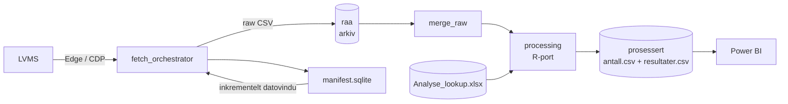
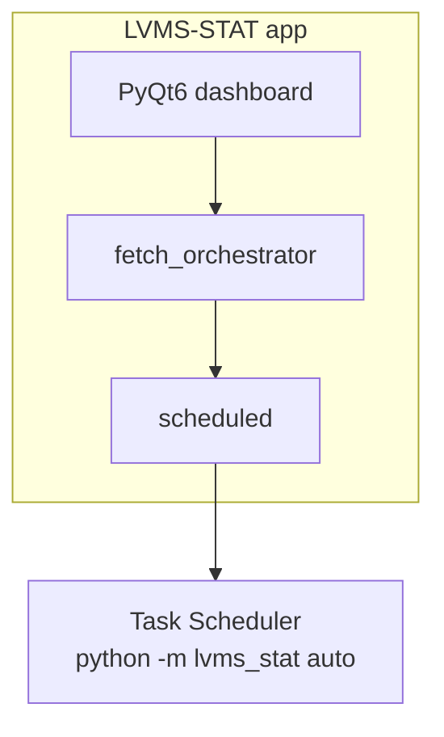

# LVMS-STAT


Automatisert statistikk-pipeline for molekylær patologi: henter
rapporteksporter fra **LVMS** via Edge/CDP, arkiverer rådata på
statistikk-disken, og prosesserer dem til analyseklares CSV-filer som
**Power BI** leser direkte. Erstattet de gamle R-scriptene med en
validert Python-port — celle-for-celle identisk output.

> 🇳🇴 Utviklet for OUH MolPat (eMolPat-prosjektet).
> Se **[JOBBS-PC.md](JOBBS-PC.md)** for oppsett på jobb-PC med K:\.

---

## ✨ Funksjoner

- 🔁 **Inkrementell henting** — SQLite-manifest husker hva som er hentet;
  hver kjøring henter bare det nye (+ 3 dagers overlapp), aldri duplikater
- 🗄️ **Skrivebeskyttet arkitektur** — rådata arkiveres først (`raa\`),
  manifestet oppdateres etterpå; en feil midt i kjøringen mister ingenting
- ⚗️ **To enheter, to profiler** — *hemato* (12-kolonne-layout) og
  *solide* (13-kolonne-layout med `Starttid.svartid`), konfigurert i
  `units.json`, ikke i kode
- 🧮 **Validert R-port** — `antall.csv` og `resultater.csv` er
  celle-for-celle sammenlignet med R-gullstandarden:
  hemato **0 avvik** (unntatt 6 celler der R selv er ikke-deterministisk),
  solide **0 avvik**
- 📊 **Power BI-uendret** — PBIX-filene peker på samme to CSV-filer som
  før; kolonnenavn og -rekkefølge er identiske med R-output
- 🖥️ **Moderne dashboard** — PyQt6-app med sidemeny, statuskort per
  enhet, «Hent nå»-knapp og loggside (mørkt tema, Power BI-gul aksent)
- ⏰ **Planlagt drift** — headless `auto`-modus for Task Scheduler;
  prosessering kjører automatisk etter hver vellykket henting

---

## 🏗️ Arkitektur





### Datoflyt per rapport

1. Les `last_completed_to` for `(enhet, rapport)` fra manifestet.
2. Ingen historikk → hent fra **01.01.2024** til i dag; ellers fra siste
   sluttdato − 3 dager (sikkerhetsmargin) til i dag.
3. Eksporter via LVMS i Edge, arkiver som
   `raa/<rapport>/<rapport>__fra__til.csv`, logg vinduet i manifestet.
4. Merge alle arkiverte vinduer med full-rad-dedup → prosesser → skriv
   `prosessert/*.csv`.

---

## 🚀 Kom i gang (lokal test uten K:\)

```cmd
git clone <repo-url> && cd LVMS-STAT
uv pip install --system -e . PyQt6

:: valider hele pipeline mot ekte data lokalt
python scripts/local_pipeline_test.py

:: åpne dashbordet (ingen filomdøping nødvendig)
python -m lvms_stat app
```

E2E-testen simulerer K-strukturen under
`%LOCALAPPDATA%\LVMS-STAT\statistikk-test`, henter tre overlappende
vinduer, merger, prosesserer og sammenligner celle-for-celle mot
R-gullstandarden:

```
PASS [hemato]: matches R gold standard (documented R nondeterminism)
PASS [solide]: matches R gold standard
```

---

## 📦 Produksjon på jobb-PC

```cmd
setx LVMS_STATISTICS_ROOT "K:\Sensitivt\Klinikk\Sensitiv_mappe_MolPat\Hemato\Statistikk"
python -m lvms_stat auto --config "%LOCALAPPDATA%\LVMS-STAT\settings.json"
```

Full steg-for-steg guide (konfig, lookup-filer, første kjøring,
Task Scheduler, feilsøking): **[JOBBS-PC.md](JOBBS-PC.md)**.

Repoet inneholder både `config.json`, `jobs.json` og `units.json` samt
tilsvarende `*.example.json`. De inncheckede filene er trygge
standard-/demofiler uten passord. GUI-et og eMolPat bruker ikke disse som
personlig konfigurasjon: **Oppsett** lagrer aktive verdier i
`%LOCALAPPDATA%\LVMS-STAT\settings.json` og `units.json`, slik at `git pull`
ikke overskriver jobb-PC-oppsettet. `jobs.json` er kun relevant for den
eksplisitte `run-batch`-kommandoen.

Integrasjon i eMolPat er beskrevet i
**[docs/EMOLPAT_INTEGRASJON.md](docs/EMOLPAT_INTEGRASJON.md)**.

---

## 📁 Prosjektstruktur

```
src/lvms_stat/
├── __main__.py            CLI: app | run-batch | auto
├── qt_app.py              PyQt6-dashboard (sidemeny, kort, logg)
├── dashboard_state.py     ren logikk bak statuskortene
├── fetch_orchestrator.py  inkrementell henting per enhet
├── incremental.py         datovindu-beregning (overlap, backfill)
├── manifest.py            SQLite-kjørelogg + statistics_root-oppslag
├── archive.py             flytt-til-arkiv-før-manifest
├── merge_raw.py           dedup-merge av alle arkiverte vinduer
├── processing.py          R-porten: clean/match/svartid/lookup/eksport
├── post_processing.py     orkestrerer merge + prosessering per enhet
├── scheduled.py           auto-modus: hent → prosesser (aldri kræsj)
├── units.py               enheter = konfigurasjon (hemato/solide)
├── batch_runner.py        Edge/CDP batch-kjøring (uendret kjerne)
└── ...                    edge-, cdp-, dom-, downloads-moduler
tests/                     191 tester (pytest)
scripts/local_pipeline_test.py   lokal E2E mot R-gullstandard
```

## 🧪 Validering

| Datasett | Rader | Avvik mot R |
|---|---|---|
| hemato `resultater.csv` | 45 300 | 6 celler / 3 rader *(R sin ikke-determinisme)* |
| hemato `antall.csv` | 70 117 | **0** |
| solide `resultater.csv` | 17 030 | **0** |
| solide `antall.csv` | 27 632 | **0** |

De 6 avvikscellene er dokumentert som en ekte svakhet i R-scriptet
(ikke-deterministisk sortering ved nest-lik ferdig-tid); Python velger
konsistent det R *mente*.

## 🛠️ Teknologier

| Lag | Verktøy |
|---|---|
| GUI | PyQt 6 |
| Automatisering | Microsoft Edge + Chrome DevTools Protocol |
| Data | stdlib-only prosessering (csv, zipfile/XML, sqlite3) |
| Test | pytest (191 tester + 60 subtester) |
| BI | Power BI Desktop (uendret) |

## 📄 Lisens

Intern bruk — OUH MolPat / eMolPat.
